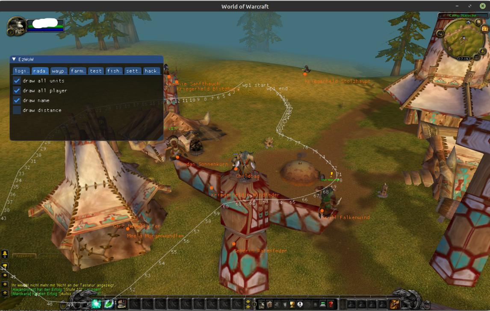

EzWoW 3.3.5
===========

This is an unfinished project I worked on about seven years ago while learning some Linux game hacking.
Back in the days, when cpp snake_case was cool and docker was new.

I am sharing the unfinished code as a resource for people interested in learning about game hacking on Linux, 
specifically as a base for a World of Warcraft WotLK 3.3.5 bot.

__Please do not try to get this stuff running. Use it as inspiration for your own projects!__ 

## Overview

- Hooks OpenGL to display an ImGui interface
- Contains multiple unfinished modules and logging for:
  - Executing Lua scripts
  - Auto login
  - Basic hacks: fly, wall climb
  - Grind bot
  - Locating NPCs via MySQL database with data from TrinityCore
  - Pathfinding with Recast and Detour

Special thanks to the https://www.ownedcore.com community.




## Dependencies

Install the following packages (package names may differ by distro):

```sh
cmake
g++
g++-multilib        # cross-compile 32-bit on 64-bit
sudo apt-get install libgl-dev      # OpenGL headers
sudo apt-get install libmysqlclient # MySQL client libraries
```

Download `Linux - Generic (glibc 2.12) (x86, 32-bit), Compressed TAR Archive` from https://dev.mysql.com/downloads/mysql/ (Ubuntu Linux 32-bit, version 18 worked during development) and extract it into `./libs`.

Download mmaps from https://github.com/Torrer/TrinityCore-3.3.5-data

## MySQL Docker Database

1. Download the full database from:
   https://github.com/TrinityCore/TrinityCore/releases/tag/TDB335.20041
2. Unzip the SQL file to `./db`.
3. Add these two lines to the top of the SQL file to create the `world` database:
   - `CREATE DATABASE world;`
   - `USE world;`

Build and run the database Docker container:

```sh
cd lnxwow/db
docker build --tag trinity_db .
docker run --rm -p 6603:3306 --name my-container trinity_db:latest
```

## Credits

This project is based on or uses the following open source projects:

- https://github.com/Jnnshschl/AmeisenNavigation
  - Navigation mesh server for the bot based on TrinityCore MMAPs and Recast & Detour
- https://github.com/ocornut/imgui
  - ImGui for in-game display
- https://github.com/wyrover/subhook
  - Subhook for function hooking
- https://github.com/torin-carey/simple-matrix
  - Simple matrix math for world-to-screen calculations
- https://github.com/SqliteModernCpp/sqlite_modern_cpp
  - C++ wrapper used here for communication with the MySQL Docker container

